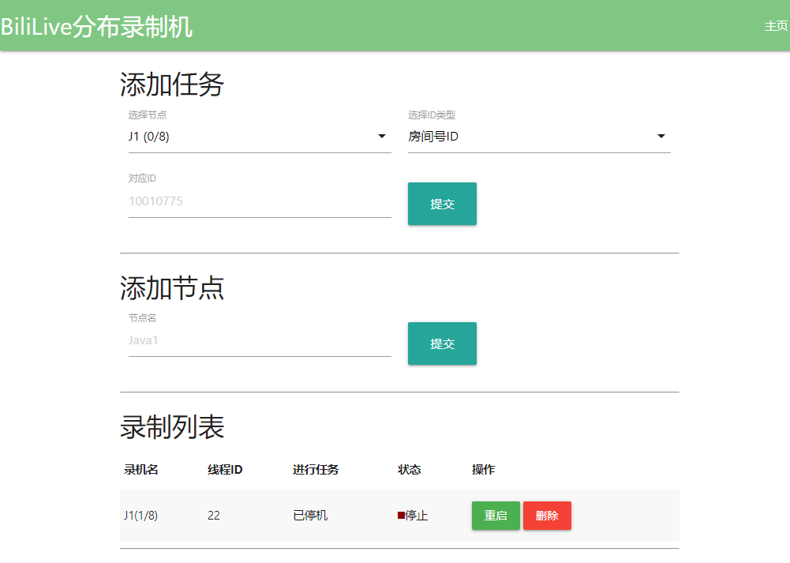

# BiliLive 分布式录机

[](https://travis-ci.org/ssysm/BLDR)
[](https://wakatime.com/badge/github/ssysm/BLDR)

BLDR: Bilibili Live Distributed Recorder. 一个为可扩展性而生的直播录机。 A live stream recorder that is scalable. 



## 运行需求
 - Java 11+ (节点+任务服务器)
 - Redis缓存服务器2.4.5+ (任务服务器)
 - FFmpeg 4.2.0+ (节点) 

## 运行步骤

-  从 [`Release`](https://github.com/ssysm/BLDR/releases) 下载zip文件或自行构造 (`./gradlew assemble`)

### 节点运行步骤
1. [可选]将FFmpeg的二进制文件夹导出至`FFMPEG_BIN`, 例 `export FFMPEG_BIN=/opt/ffmpeg/bin/`
1. 编辑 `app.conf` [详解](#节点配置详解)
1. `java -jar BiliLiveWorker-[版本].jar app.conf`

### 任务服务器运行步骤

1. 编辑 `app.conf` [详解](#任务服务器配置详解)
1. `java -jar BiliLiveDispatch-[版本].jar app.conf`
1. 打开浏览器，转到 `http://服务器IP:配置端口/`, 进行节点配置

## 配置详解

### 节点配置详解
```$HOCON
redis { # Redis服务器配置
  host : "localhost", # Redis服务器地址
  port: 6379, # Redis服务器端口
  password: "" # Redis服务器密码（无密码留空即可）
}

ffmpeg { # FFMPEG配置
  path: ${?FFMPEG_BIN}, # FFMPEG二进制文件夹路径（尽量无非ASCII字符）
  output: "."  # FFMPEG录制文件夹路径（尽量无非ASCII字符）
}

worker { # 节点配置
  name: "J1" # 节点名称，！在同一池内节点名称不能重复！
  waitTime: 10000 # Live地址刷新时间，！尽量不要低过每10秒！
  maxThread: 8 # 最大线程数，！尽量不要高于主机主核的2倍！
  reportTime: 1500 # 节点状态汇报间隔，！尽量不要低于2秒！
}
```

### 任务服务器配置详解

```$HOCON
redis { # Redis服务器配置
  host : "localhost", # Redis服务器地址
  port: 6379, # Redis服务器端口
  password: "" # Redis服务器密码（无密码留空即可）
}

http { # HTTP服务器配置
  port: 8888 # HTTP监听端口，！启动前确保端口没有被占用！
}
```

## 系统架构

### `BiliLiveDispatcher` 任务服务器

#### `com.theeditorstudio.bililive.dispatcher.factories`
对象构造工厂

#### `com.theeditorstudio.bililive.dispatcher.routes`
Spark HTTP服务器路径业务逻辑

### `BiliLiveWorker` 节点

#### `com.theeditorstudio.bililive.worker.factories`
对象构造工厂

#### `com.theeditorstudio.bililive.worker.handlers`
各类事件业务处理逻辑

#### `com.theeditorstudio.bililive.worker.services`
HTTP请求服务

#### `com.theeditorstudio.bililive.worker.threads`
多线程`Runnable`类

#### `com.theeditorstudio.bililive.worker.types`
自定义数据类型

## 已知Bug

### 节点+任务服务器已知Bug
 - 无共同已知Bug

### 节点已知Bug
 - 内部：主进程不能 `SIGTERM`/ `SIGKILL` (任何强行关闭操作)，会留下未关闭的ffmpeg进程。\
    （解决方法：使用bash脚本批量结束ffmpeg进程,或在任务面板关闭进程）
 - 内部：在使用`Future.cancel(true)`的时候不能正确的修改线程状态。\
    （解决方法：查看`job.thread_stopped`的布尔值）
 - 消息通道：当新工作被下发时，尽管线程在请求，但状态保持在`V`(空闲)。\
    （解决方法：暂无，只能等待更新）

### 任务服务器已知Bug
 - 网页：当Worker下线之后还在显示状态。\
    （解决方法：使用查看节点最后更新时间）
 - 网页：无法验证新添加节点状态。\
    （解决方法：同上）
 - 网页：部分警告提示未翻译完整。\
    (解决方法：暂无，等待下一版本)

## 开源

BLDR, [Licensed](LICENSE) under GNU General Public License 3.0.

BLDR的诞生离不开这些开源软件：
 - [kokorin/Jaffree](https://github.com/kokorin/Jaffree)
 - [lightbend/config](https://github.com/lightbend/config)
 - [xetorthio/jedis](https://github.com/xetorthio/jedis)
 - [stleary/JSON-java](https://github.com/stleary/JSON-java)
 - [qos-ch/slf4j/slf4j-log4j12](https://github.com/qos-ch/slf4j/tree/master/slf4j-log4j12)
 - [perwendel/spark](https://github.com/perwendel/spark)